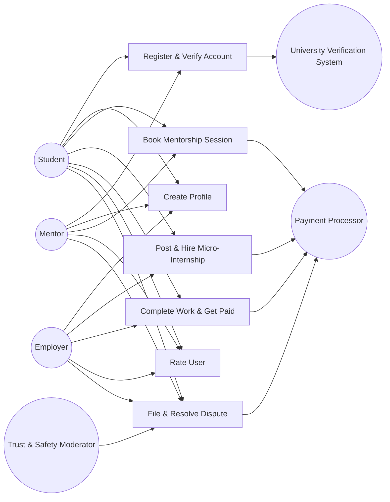
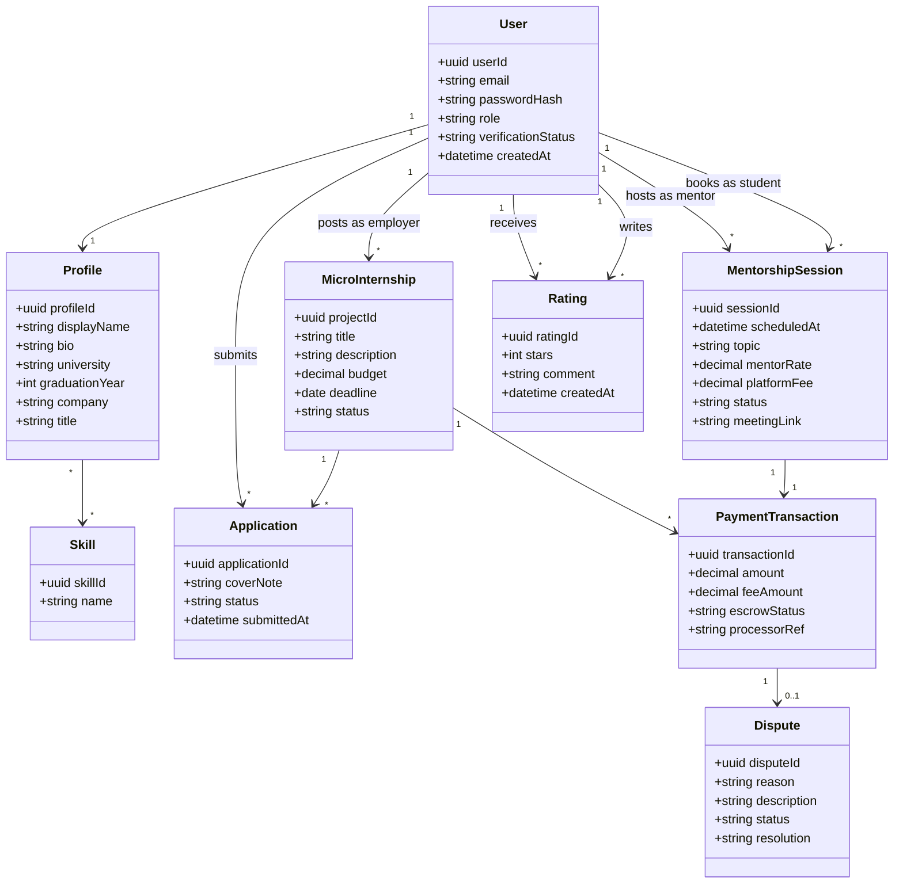
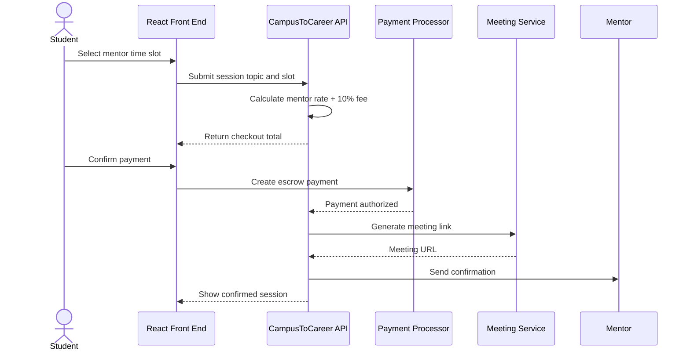
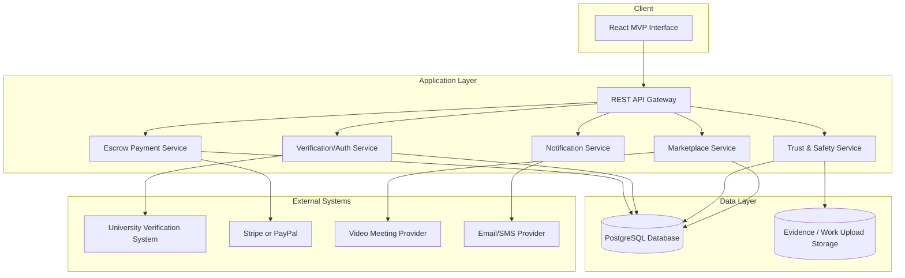
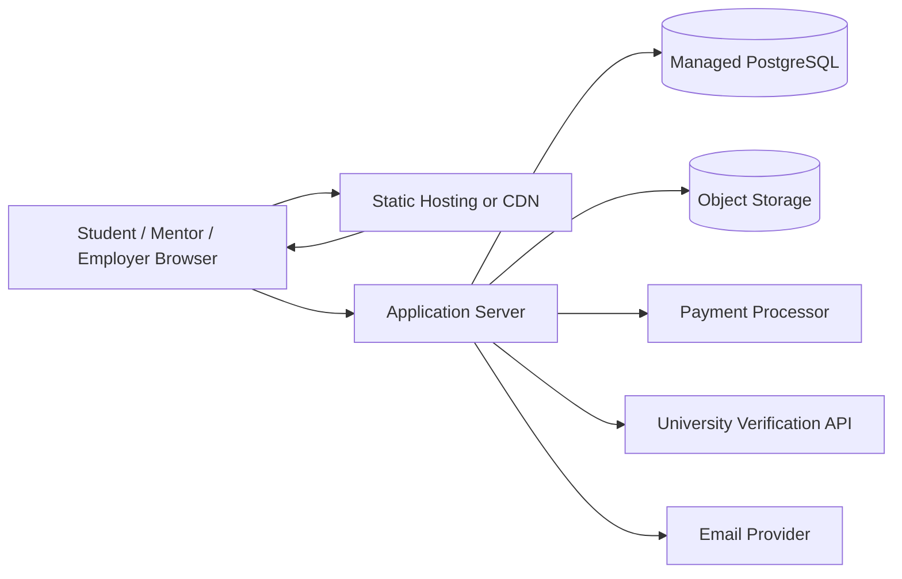

# CampusToCareer System Models

## 1. Use Case Diagram

## 2. Domain Model Class Diagram

## 3. System Sequence Diagram: Book Mentorship Session

## 4. System Architecture Diagram

## 5. Deployment Diagram

## 6. User Interface Screens

The implemented React prototype provides these screens:

- Student hub: mentor search, session booking, and micro-internship marketplace
- Mentor search: verified alumni mentor directory
- Employer tools: project posting form, posting fee, and hiring workflow status
- Trust and safety: dispute cases, locked funds, and suggested resolutions

Source location: `src/main.jsx` and `src/styles.css`.
